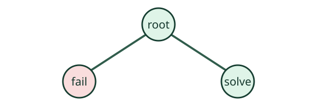

.. _sec-first-model:

A first model
=============

The model derives from :api:`Gecode::Space <class:Gecode::Space>`, and the
method is described by Schulte and Stuckey :cite:p:`schulte2008`. The release
inventory resolves that typed API symbol without building the Gecode reference
manual as part of this publication.

.. math::
   :label: eq-send-more-money

   \Gecode: \quad SEND + MORE = MONEY

.. _fig-search-tree:

   A small search tree in vector form.

The complete file is canonical. Only its named posting region is projected here.

.. literalinclude:: ../examples/send-more-money.cpp
   :language: cpp
   :start-after: // region posting
   :end-before: // endregion posting
   :caption: The checked linear constraint posting
   :name: program-posting
   :linenos:

:download:`Download the exact tested program <../examples/send-more-money.cpp>`.

.. list-table:: Tested release contract
   :name: table-contract
   :header-rows: 1

   * - Artifact
     - Consumer
   * - Reference inventory
     - API links
   * - Tested C++ example
     - Listing and download

.. mpg-tip:: Release publication

   Publication is a release job. Astro imports the finished semantic bundle.

Continue to :doc:`second-page`.

References
----------

.. bibliography::
